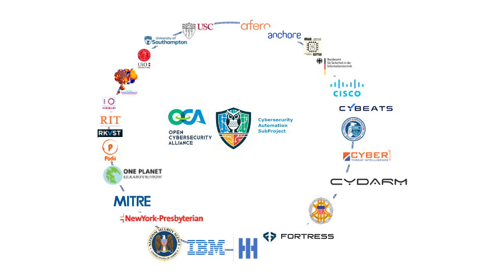

---

# Announcement

The 
[Open Cybersecurity Alliance (OCA)](https://opencybersecurityalliance.org/)
[Cybersecurity Automation SubProject (CASP)](https://opencybersecurityalliance.org/casp/)
organized a Cybersecurity Automation Village
which was held June 13th, 2023 at USC and hybrid.
For more information, read the rest of this page and/or see:
* [Scenario](./UseCases/README.md)
* [Logistics](./logistics.md)
* Registration - see Logistics

Note the CASP event was the day before, and in the same venue as, the CISA SBOMarama.
For more information on the CISA SBOMarama see
[Federal Register annoucement](https://www.federalregister.gov/documents/2023/05/22/2023-10825/2023-cisa-sbom-a-rama)
or [CISA website](https://www.cisa.gov/sbom).

---

# Village = Workshop / Plugfest / Hackathon

# Objective
The [Open Cybersecurity Alliance (OCA)](https://opencybersecurityalliance.org/)
[Cybersecurity Automation SubProject (CASP)](https://opencybersecurityalliance.org/casp/)
is comprised of global like-minded cybersecurity vendors, end users, thought leaders and individuals who are interested in cybersecurity automation.

It is a forum where products from all vendors, researchers, and software publishers can freely exchange information, insights, and reference implementations via commonly developed code and tooling, using mutually agreed upon technologies, specifications, and procedures.

The Cybersecurity Automation Village is an event is for 
sharing information, prototyping, testing, 
and specifying interoperability among cybersecurity automation technologies.
The focus of this event will be [this usecase](./UseCases/README.md).

Information on previous and future events can be found at
[plugfests](../../Plugfests/).

# Projects Involved
This is a tenative list of the projects (technologies, standards, open source) hoped to be interworked
in CASP usecases at this plugfest:

For more information on how the technologies/... will be demonstrated,
see [Demo Use Case](./UseCases/README.md)
and [Demo Use Case tech](./UseCases/use_case_tech.md).

# Organizations
This is a tenative list of organizations it is hoped will participate
with sweat equity.

This needs updating with actuals!

It was created from participation at previous events and/or interest
expressed at CASP meetings.
This will be finalized as registration is figured out and
[sweat equity](./SweatEquity/README.md) is populated.

See [sweat equity](./SweatEquity/README.md)
for what was provided by the participating orgs.

# Results
The Cybersecurity Automation Village was a success.
The attendees represented 24 organizations from 5 countries on 4 continents.
Results can be found in [results](./Results/README.md).

# To Participate
To participate, subscribe to the
[CASP mailing list](https://lists.oasis-open-projects.org/g/oca-casp),
attend the biweekly
[CASP meetings](https://lists.oasis-open-projects.org/g/oca-casp/calendar),
and join the #casp channel on [OCA Slack](https://app.slack.com).

# Frequently Asked Questions (FAQ)
See the [SBOMarama CASP FAQ](faq.md) for questions 
specific to this event. 
See the [overall CASP FAQ](../../CASP-FAQ.md) for questions 
about CASP, or cybersecurity automation, overall.
