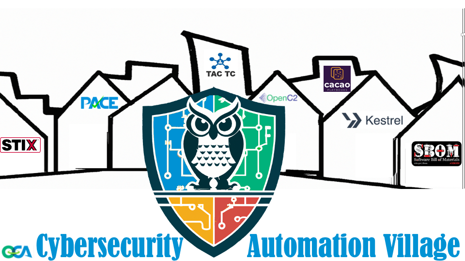
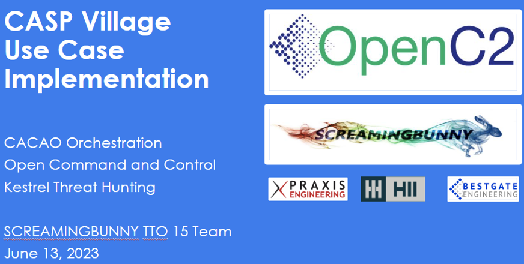

# Meeting Notes for Cybersecurity Automation Village 13-June-2023



The [Cybersecurity Automation Village]()
was organized by the 
[Open Cybersecurity Alliance (OCA)]()
[Cybersecurity Automation SubProject (CASP)]
and kindly hosted by RIT and USC at USC Campus in LA,CA.

Thank you to
[OASIS-Open](https://www.oasis-open.org/)
for kindly sponsoring lunch.
 
There were ~16 in-person attendees and ~27 additional virtual-only attendees
(strict attendance was not taken and we may have missed some attendees).
The attendees represented 24 organizations from 5 countries on 4 continents.

Attendance was significantly less than previous events - attributed to the short
notice in planning and announcing the event.

Agenda:


| Time  | Topic | Wrangler |
| ------------- | ------------- | ------------- |
| 10:30  | Set-up, Kick-off  | Duncan Sparrell  |
| 10:45  | Strategic Objectives  | Bret Jordan  |
| 11:00  | Use Case Overview, Project Review  | Duncan Sparrell  |
| 12:00  | Lunch  | All  |
| 1:00	| OpenC2 - JADN - Kestrel - STIX Shifter  | David Kemp |
| 1:30	| CACAO | Bret Jordan |
| 2:00	| TAC  | Ryan Hohimer |
| 2:30	| Break | All |
| 2:40	| OCA IOB | Charlie Frick |
| 3:10	| PACE / SBOM / VEX	| Duncan Sparrell |
| 3:30	| Review, Next Steps | Duncan Sparrell |
| 3:55	| Clean-up, Leave Room	| All |

See [results](../Results/README.md#2-recording) for a video of the event.

## Set-up & Kick-off
Duncan Sparrell (sFractal Consulting) 
welcomed the group and thanked the hosts and sponsor.
Duncan noted that it takes a Village to accomplish Integrated Adaptive Cyber Defense.
Many OASIS Open Technical Committees. OASIS Open Projects, and other relevant groups
are developing standards and project demonstrations.
The purpose here today is to explore the interoperability of many of these initiatives.

Duncan went over logistics and started the meeting recording -
which can be found at {fill in later}.

Duncan Sparrell presented visual overview of the standards included in the Village:


## Strategic Objectives

Bret Jordan (Afero) gave some background on the security standards that have been developed 
for this work e.g CTI TC, CACAO, TAC, OpenC2 and others…
Some standards are going to the ITU (e.g., STIX 2.1) and some to ISO (e.g. CSAF).
•	Noted that the efforts on demonstration today represent over a decade of work by many contributors
•	Efforts can only be effective if there is interoperability among and between the standards and the various open-source implementations and vendor products 

## Use Case Overview & Project Review

Duncan Sparrell presented an overview of the scenario to be used.
		
The [WhitchyWashy Ransomware Use Case](https://github.com/opencybersecurityalliance/casp/blob/main/Plugfests/NextPlugfest/2023-06-13-USC/UseCases/README.md):

 * Day 1 - Murphy’s Law LLP
 * Day 2 - On Deck Holdings
 * Day 3 - Triumvirate CleanUp Inc
 * Day 4 - NSAANSA
 * Day 5 - Law Enforcement
 * Day 6 – MilOps

The objective is to use as many  projects on as many days as possible using:

* Machine-to-Machine API’s (ideally between different orgs)
* Humans (ideally humans "on the loop" as opposed to "in the loop")
* Handwaving (when something doesn't work, wave your hands and describe how it should work, or how it will work in the future)

It was noted that some levity was introduced in the creation of this ficticious scenario.
It was agreed this is a serious topic, and the humor was not intended to minimize the importance of this work.

### DAY 1 – Murphy’s Law LLP

During the vows at a daughter’s wedding, midway through an emergency root canal, at 8 a.m. on Christmas morning the CEO of Murphy’s Law LLP receives a most unwelcome message: a brand-new exploit has made its world-wide zero-day debut in the company’s system. Fortunately, Murphy’s Law LLP had the foresight to adopt cybersecurity automation protocols. An immediate Kestrel threat hunt finds the exploited systems, and the automation kicks the attackers out of the system using CACAO playbooks with OpenC2 commands, alerts law enforcement, and analyzes the tactics and exploited vulnerabilities. Recognizing this as a zero-day, STIX bundles are prepared containing the threat information (IoCs, IoBs, TAC) and playbooks for prevention/detection/response (CACAO, OpenC2). The STIX information is shared with their ISAC for distribution to others in their industry. Because the attacks exploited previously unknown vulnerabilities in both commercial and open source software, Murphy's Law LLP submits new VEXes.

DEMONSTRATES


### DAY 2 - On Deck Holdings

Panic begins anew at On Deck Holdings as a stark uptick in server activity signals that yesterday’s exploits at Murphy’s Law LLP have spread to new haunts. Fortunately, On Deck Holdings previously received STIX information from their ISAC. Being similarly automated, On Deck Holdings’ cybersecurity systems soon match their problem with the STIX object generated the day before, initiate the CACAO playbook, execute OpenC2 commands, and freeze out the black hat hackers that gained entry into their system.

DEMONSTRATES


### DAY 3 - Triumvirate CleanUp Inc

As the unknown exploit becomes a known entity, the zero-day becomes an N-day.
Triumvirate CleanUp Inc, also a subscriber to their ISAC, analyzes the STIX bundle and decides to use their PACE system to analyze their environment and see if they are vulnerable to the same attack that targeted Murphy’s Law and On Deck. Using their PACE system, they analyze their SBOM's and discover they do have 70 devices with components that have the CVEs reported in the STIX bundle. Further analysis with PACE shows that 30 of those potentially affected devices have VEXes from their suppliers that indicate they are not susceptible to those CVEs. Triumvirate CleanUp then initiates automated patching to harden the remaining 40 devices and avoids getting hacked.


DEMONSTRATES

 

### DAY 4 – NSAANSA

The Never Say Anything and No Such Agency (NSAANSA) in the US Dept of Useless Factoids has automated cybersecurity adhering to federal guidelines including the "comply to connect" edict, which requires any new devices connecting to a network to have an acceptable security posture. NSAANSA's ISAC feed receives the STIX bundle, and their systems automagically convert that information into new rules for calculating security posture in their PACE system. 

When a new device attempts to connect to the NSAANSA environment, their security posture assessment includes the PACE system examining device SBOMs and VEXes including looking for impact of the WhitchyWashy CVEs. 

Although NSAANSA is not the lead agency for sharing comply-to-connect policies with the State/Local/Tribal-Territories (SLTT), NSAANSA creates a NIEM IEP information packet for SLTT consumption and implementation and transmits that to the lead agency, CISA, for transmission to the SLTT.  [Editor’s Note: This is not a comedy, although the fictious names are comedic. This is serious business.]

DEMONSTRATES


### DAY 5 – Law Enforcement

Initially brought into the loop and involved throughout, law enforcement prepares multiple NIEM Message Exchange Packages (MEP) for entry in the Law Enforcement National Data Exchange (N-DEx) and for exchanges with the Royal Canadian Mounted Police (RCMP), Europol, and Interpol. A criminal takedown across 6 countries occurs and 23 miscreants are put behind bars using evidence and e-filings built from NIEM MEPs.
DEMONSTRATES

 

### DAY 6 – Military Operations
It can neither be confirmed nor denied whether rogue nation states were involved in this use case; just as it can neither be confirmed nor denied whether NIEM MilOps extensions were distributed among NATO allies and hunt forward operations bricked adversary servers behind the attack. Day 6 is out-of-scope for the Cybersecurity Automation Village.
DEMONSTRATES


### Q&A and Chat
When asked when people thought these projects would be implemented, the answers varied. 
William Gibson was quoted: "The future is already here, it's just not evenly distributed."
Some of the projects are mature and in production.
Some of the projects were just started this year.
The evolution of SBOM was mentioned and that 5 years ago
it was a group smaller than this but tomorrow's CISA SBOM-a-rama the next day at USC 
would have 1,000 people and it is now a federal mandate. 
It was mentioend one of the reasons that the Village was the day before SBOM-a-rama 
was because of SBOM/VEX being in our use case.
Neal Ziring's keynote at CASP in 2021 was mentioned predicting CASP referenced in
Federal procurements by FY2024. 
See https://www.youtube.com/watch?v=cWL8wiSi-Rs.

 
## Lunch Break

## OpenC2 - JADN - Kestrel - STIX Shifter

Dave Kemp presented on OpenC2/Kestrel/Stix Shifter interworking

OpenC2 is a standardized language for the command and control of technologies that provide or support cyber defenses. By providing a common language for machine-to-machine communication, OpenC2 is vendor and application agnostic, enabling interoperability across a range of cyber security tools and applications. The use of standardized interfaces and protocols enables interoperability of different tools, regardless of the vendor that developed them, the language they are written in or the function they are designed to fulfill.

Kestrel is an Open Cybersecurity Alliance (OCA) subproject developing a threat hunting language which provides an abstraction for threat hunters to focus on what to hunt instead of how to hunt. It is a threat hunting language aiming to make cyber threat hunting fast by providing a layer of abstraction to build reusable, composable, and shareable hunt-flow. Software developers write Python in machine code to quickly turn business logic into applications. Threat hunters write Kestrel to quickly turn threat hypotheses into hunt-flow. We see threat hunting as an interactive procedure to create customized intrusion detection systems on the fly, and hunt-flow is to hunts as control-flow is to ordinary programs.

STIX-shifter is also an OCA Subproject. It is an open source python library allowing software to connect to products that house data repositories by using STIX Patterning, and return results as STIX Observations.
This library takes in STIX 2 Patterns as input, and "finds" data that matches the patterns inside various products that house repositories of cybersecurity data. Examples of such products include SIEM systems, endpoint management systems, threat intelligence platforms, orchestration platforms, network control points, data lakes, and more. In addition to "finding" the data by using these patterns, STIX-Shifter also transforms the output into STIX 2 Observations. Why would we do that you ask? To put it simply - so that all of the security data, regardless of the source, mostly looks and behaves the same.

Demo Proceeds – Some screenshots follow

 

### OpenC2 Demo: OIF & Yuuki, Kestrel Interface, TwinklyMaHa

Larry Feldman
	Described Cybersecurity Automation Use Case – 
We want to show how OpenC2 & CACAO work together


Kevin Cressman
	Verbally described how CACAO Orchestrates the OpenC2 Threat Hunt Actuator Profile as seen on the following figures.  


OpenC2 Live Orchestrator Demo by Matt Roberts, Kaitlyn Hsu, and Kouloum Abidji
	Used MQTT & JSON
		Used Yuuki Device

Demo’ed Kestrel Hunt – Switched from Orchestrator to Logs to demonstrate

Demo’ed Relay Command – Details follow

Interact w/ OpenC2 OIF:  BROKER = '3271a3ddd2eb43caa7c4b195c7d6cabd.s2.eu.hivemq.cloud' PORT = 8883 USERNAME = 'Cav01' PASSWORD = see Matt or Dave Kemp TOPIC_REQUEST = 'oc2/cmd/device/oif'  TOPIC_RESPONSE = 'oc2/rsp'

```
// Sample JSON Command - Add a UUID for the Request ID
{
  "headers": {
    "request_id": "07ebf23d-e492-42a9-9c6a-9a559d0b86bf",
    "from": "oc2/rsp",
    "to": "oc2/cmd/device/oif",
    "created": 1686687573837,
    "actuator_id": "8144acd3-f5d6-4bda-b1bd-a964f4a19677"
  },
  "body": {
    "openc2": {
      "request": {
        "action": "investigate",
        "target": {
          "th": {
            "hunt": "./hunts/find_data_via_stixshifter.hf"
          }
        }
      }
    }
  }
}
``` 

Duncan Sparrell
	Did have planned to have a RaspberryPi demo – Not working now. 
	So, we’ll do the Twinkly Maha Demo – From Cloud Service
		https://twinklymaha-staging-q353uyxfhq-uk.a.run.app/twinkly 

		https://openc-c2-test-q353uyxfhq-uk.a.run.app/run_script 

		OIF communicates from the Twinkly Maha to the OpenC2 Orchestrator

## CACAO
CACAO Standard Overview - Bret Jordan
	
The Collaborative Automated Course of Action Operations (CACAO) TC members are developing a standard to implement the course of action playbook model for cybersecurity operations.

In order to defend against cyber threats, organizations must manually identify, create, and document the prevention, mitigation, and remediation steps that, together, form a course of action playbook. However, today, there is is no standardized way to document and share these playbooks across organizational boundaries and technology solutions. CACAO addresses this problem by defining a sequence of cyber defense actions that can be executed for each type of playbook. It will specifically enable organizations to:

1.	create course of action playbooks in a structured machine-readable format,
2.	digitally sign course of action playbooks,
3.	securely share course of action playbooks across organizational boundaries and technological solutions, and
4.	document processing instructions for course of action playbooks in a machine readable format.

Purpose of CACAO is to connect the dots

 

As shown in the following figure, a Course of Action is a highly complex process

 

With CACAO we are able to automate the parts of the work flows that can be automated to provide more effective interactive adaptive cyber defense.  

 

Walked through an example of Digital Signing using CACAO

 

The following figure provides a schematic that shows what each Playbook contains.

 


And, for those accustomed to BPMN diagrams, CACAO can be easily represented in this manner.

 

For more information go to:  

	https://github.com/oasis-tcs/cacao/tree/master/Examples/CACAO-2.0 
	
	Vendors and government organizations are beginning to build product using the standard.  
What follows are some quick demonstrations of how it is being used 

CACAO Implementation Demo - Vaughn Shanks 

Offered some observations about what they have done to build their product.

 * Goal: build software to execute CACAO playbooks
 * Problem: no repository of CACAO examples!?!
 * 81 existing playbooks written by CISA in BPMN
   * https://github.com/cisagov/shareable-soar-workflows
 * Why not convert BPMN XML to CACAO JSON?
   * https://github.com/cydarm/bpmn-to-cacao released 12 June 2023 (yesterday!)
 * Now we have many CACAO examples!
 * Challenges:
   * Some control structures are not yet well handled
   * CACAO logic uses procedural programming norms, BPMN does not, eg. “gateways” - translation compatibility issues
   * Still need to add OpenC2 or similar to automates steps
 * Contributions welcomed!


Vasileios Mavroeidis (In Chat)

You can read more about BPMN-CACAO mapping and reviewing the BPMN modeling notation to visually representing CACAO Playbooks:  https://arxiv.org/pdf/2305.18928.pdf


Live Demo followed.  Below are two screenshots from the Demo.

 


 

CACAO Implementation Demo - Vasileios Mavroeidis

Showed how they use the STIX2.1 Course of Action SDO to point to a CACAO Security Playbook

 

	Further details can be found at the Github link on COA Playbook Extensions

https://github.com/cyentific-rni/stix2.1-coa-playbook-extension
 
 


Demonstrated the GUI of the online Tool that his team has developed.

## Threat Actor Context (TAC) 

Threat Actor Context TC DEMO – Ryan Hohimer

	Ryan Hohimer
		Threat Actor Context TC
			OASIS TAC TC: https://www.oasis-open.org/committees/tac
Github: https://github.com/oasis-open/tac-ontology

The Threat Actor Context (TAC) ontology is a community-driven project led by the OASIS Threat Actor Context Technical Committee. The TAC ontology is a knowledge representation framework focused on comprehensively representing the context around adversaries. The project comprises a set of concept definitions and their relationships encoded in Web Ontology Language (OWL) that altogether harmonize into what we call the Threat Actor Context ontology.

 * Exchange Format to Analysis Format
   * STIX 2.1 Specification to STIX 2.1 Ontology
     * Separates the Data from the Model
 * STIX JSON to STIX Knowledge Graph
 * Formal Logic
   * New Facts from Existing Facts
   * From Implicit Knowledge to Explicit
 * Classifying Threat Actors Analysis 
   * Use Case: Intel Threat Agent Library (TAL)


 

From Chat:
Vasileios Mavroeidis 2:07 PM
You can even run TAC in neo4j 🙂

Vasileios Mavroeidis 2:10 PM
Basically, what Charles OCAI IOB will visualize later is a property graph which is different than a knowledge graph

Vasileios Mavroeidis 2:10 PM
All properties and their values become first-class citizens

Vasileios Mavroeidis 2:11 PM
Queries are simplified that way

Vasileios Mavroeidis 2:13 PM
STIX JSON integrates the data and the model. TAC separates data from the model. You can change the model and the data will be interpreted differently.

 


 

 


Demo of the TAC Ontology

 

	Also provided are some utilities that can be executed. These will convert the STIX2.1
		Into the ontological representation (as OWL/RDF). 
[Shown in the lower part of the next screenshot]

Tools from Vas:  	https://www.stardog.com/ 
			https://jena.apache.org/documentation/fuseki2/ 

Comments in Chat:
Vasileios Mavroeidis 2:33 PM
I would say that it is based on the use case. The problem is that ontologies have a learning curve but offer many benefits

Vasileios Mavroeidis 2:34 PM
You are well-versed in namespaces and this is also one of the advantages of the ontologies. They use URIs and then every instance is considered a “thing”. Many times are resolvable.

Mateusz Zych 2:34 PM
JSON is closely couplet with JSON-LD. We have experimented also with that., creating context for the json files. So JSON can be used with small additions

Vasileios Mavroeidis 2:36 PM
STIX has done a great job in representing the domain of CTI using JSON. Conceptual objects and relationships that are also objects -> property graph

David Kemp 2:37 PM
Loose coupling is desirable, to allow those who have climbed the ontology learning curve are able to fully benefit from it, without requiring everyone (message designers) to climb that curve.

Vasileios Mavroeidis 2:37 PM
If you change something in STIX it is a breaking change and the data cannot be used easily with the updated versions. Ontologies separate the data in triples and the model just interprets the data.

Vasileios Mavroeidis 2:54 PM
It is very good work. Almost like having a CTI platform

 

Converts it to a Graph representation. Then, it can be used to run queries.

 

Tools Used:

	Protégé’ is the tool for developing the Ontology
Qureries on SPRQLanything – 
Open source on Github – Converts STIX2.1 JSON into RDF Graph
	Multiple Open-Source Triple Stores

## IOB
Indicators of Behavior (IOB) Demo – Charles Frick
•	Network defenders struggle to obtain and use Cyber Threat Intelligence
•	STIX provides a useful standard for packaging the data, but the proper context is needed
•	MITRE ATT&CK and D3FEND provide a necessary but not sufficient capability
•	There is a need for something more general than an IOC and more specific than a high-level Attack Pattern that can be shared and utilized by various community stakeholders
o	Automation & Vendor Products
o	Network Defenders
o	Threat Intelligence Analysts

 

Below is a graph representation of an indicator of behavior as expressed in Neo4j

 

Demonstrated the underlying code for the Kestrel Huntbook (To be changed to Hunt Flow)

For more IOB information:

 * IOB Project page: https://opencybersecurityalliance.org/iob/ 
 * IOB GitHub for documentation, use cases, reference implementation
https://github.com/opencybersecurityalliance/oca-iob  

IOB Summary

Recap
IoB provides a STIX compliant bundle for 
Sharing sequences of adversary behaviors, detections, correlations, and response workflows
Allows for rapid sharing of data utilizing multiple open capabilities
Stix-Shifter
Kestrel
CACAO
Can easily incorporate OpenC2 within CACAO
Utilize TAXII for machine to machine sharing of the information
OCA IOB also provides simple STIX to Neo4J script for analysis and integration to pull relevant information/capabilities out of the shared IOB bundle
For more information visit https://opencybersecurityalliance.org/iob/  


## PACE / SBOM / VEX
### Posture Attribute Collection & Evaluation – Duncan Sparrell
 
Posture Attribute Collection and Evaluation (PACE) is a vendor-agnostic standards-based interoperable cybersecurity strategy patterned after the "integrate once, reuse everywhere" methodology. 

Utilizing command and control methodology with existing payload formats, PACE addresses both vulnerability prevention and threat/exploit mitigation. Multifaceted resources are mapped as configurations of constituent parts, including hardware components, base software, patches, and configuration. These discrete parts become semantically meaningful data points that can be compared against known exploits or actively scanned for current vulnerabilities.

Real-time structural analysis executed at a microscopic level gives individuals and organizations a priceless opportunity to prepare for or address potentially crippling cybersecurity attacks. What follows are some resources:

 * https://opencybersecurityalliance.org/pace/
 * https://github.com/opencybersecurityalliance/PACE/tree/main/docs/UseCases/Pace_Sbom_Vex_Flags_Prioritization
 * https://securityattributes.org/By_Example/ 
 * Commercial Vendors
 * Gartner Application Security Posture Management

Earlier today we did a Demo that illustrated the OpenC2 Test using MQTT on the Twinkly MaHa tool.  

 
### SBOM / VEX 
Duncan replayed the TwinklyMaha demo for new attendees. Below is a split screen image that shows the commands on the left side and the TwindlyMaHa on the right side of the screen.

 

Matt Roberts did a remote demo of the Twinkly Maha link

M {"action": "set", "target": {"blinky:led": "rainbow"}, "args": {"response_requested": "complete"}} 
{"action": "set", "target": {"blinky:led": "off"}, "args": {"response_requested": "complete"}}
Localhost:8080/.well-known/

topic  'sfractal/command'
BROKER = 'test.mosquitto.org' PORT = 1883
	
	Links to resources:

 * https://www.cisa.gov/sbom
 * https://twinklymaha-prod-q353uyxfhq-uk.a.run.app/.well-known/sbom
 * https://quadquiz-q353uyxfhq-uk.a.run.app/.well-known/sbom 
 * SBOMarama tomorrow


Question about SBOM
	Update from Alan Friedman (Joined Village in the afternoon)

		Tools that are emerging – Implementations that are integrating SBOMS into products
		Evolved into sector-specific implementations
			SPDX – New version is 3.0
	Update from Chris Blask (Joined Village in the afternoon)
			SPDX – very mature and stable
			CycloneDX – young and agile

## Review & Next Steps

Next Villages
	Borderless Cyber
11-12 Sep 2023
London, England
https://borderlesscyber2023.oasis-open.org/
2-Day Village in First Quarter 2024
	NJ or DC
	Host negotiations in progress


Meeting adjourned


