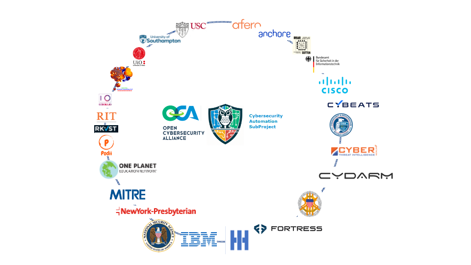
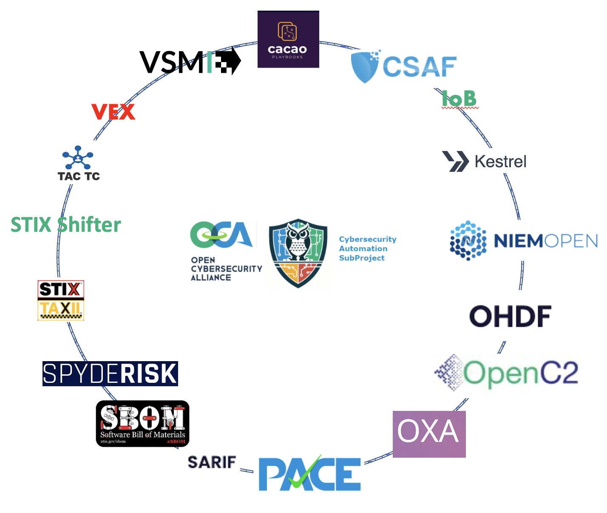

# Cybersecurity Automation Village 1Q 2024

* will be hosted by Peraton
   - at their offices at 1875 Explorer St, Reston, VA 20190
* April 11-12, 2024 Village 
  - 2 days with keynotes, workshops, plugfests, contests, and demos
  - in-person with hybrid access
  - part of event might be vendor "show & grill" ie vendors show what they have and participants grill them about availability of vendor-agnostic standard interfaces (SBOM, VEX, STIX, OpenC2, ....).
  - 1/2 day setup on April 10 for sweat equity participants with something to setup
* [Prep1](Prep1/README.md) was held virtually on December 6 as part of getting ready
* [Prep2](Prep2/README.md) will be held virtually in February, 2024 as part of getting ready

# Projects Participating
Make new version of 

See [Prep2](./Prep2/README.md#1-finalize-projects-participating) for current list.

# Companies Participating
Make new version of 

See [Prep2](./Prep2/README.md#finalize-orgs-participating) for current list.