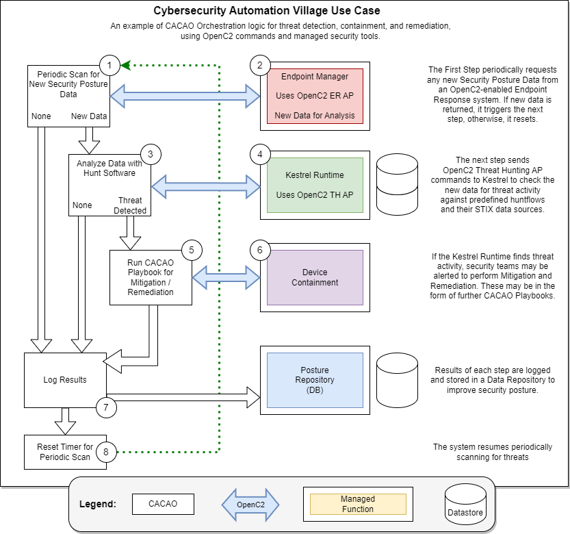

# Orchestrated Hunt Use Case
In this CASP -  OXA ([Open XDR
Architecture](https://github.com/opencybersecurityalliance/oxa)) use case, we
will explore how CACAO, Kestrel, and OpenC2 can be used together to create an
integrated and efficient cybersecurity workflow for detecting, responding to,
and mitigating a cyber threat, such as a ransomware attack. 

Our use case starts with Command Orchestration, using CACAO Playbooks. To
streamline and automate cybersecurity processes, the organization implements
CACAO playbooks specifically designed for various atomic functions. These
playbooks interface with a suite of automated actions and decision points and in
our use case, each will invoke subsequent playbooks as needed. The playbooks
will use their findings to inform cyber threat response functions. CACAO
orchestration in this example will make extensive use of OpenC2 commands for
standardized, implementation-agnostic commands that can perform critical Command
and Control functions.

Threat detection, initiated by CACAO orchestration, will be done using Kestrel.
The organization implements tools for scanning and anomaly detection, as well as
Kestrel-based software and libraries of hunting books, specifically designed to
analyze the organization’s systems to detect and classify anomalous behavior.
Kestrel commands can enable the execution of threat hunting that can retrieve,
join, and analyze data as part of an orchestration flow. 

For our use case, anomalous behavior may constitute elevated processor use or
suspicious network traffic. In the event of anomalous behavior, or as the result
of a periodic scan, the CACAO integrated scanning tools will notify a security
team and, at the same time, invoke Kestrel. This will initiate Kestrel threat
hunting by OpenC2 command to Kestrel’s STIX-shifter interface. Threat hunting
commands will use the Threat Hunting Actuator Profile (TH AP) for OpenC2 to
investigate threats with a Kestrel huntflow and analyze threat related data from
various sources, such as log files, network traffic data, and external threat
feeds. Kestrel's powerful pattern matching and correlation capabilities enable
the identification of indicators of compromise (IoCs) or/and indicators of
behavior (IoBs) associated with a known ransomware family, such as specific file
hashes, IP addresses, or domain names. 

Thus the CACAO orchestrated detection system will:

1. Detect a threat that is impacting the system.
2. Identify the threat as a ransomware attack that threatens critical files on a
   server. 
3. Generate an alert and send it to the security team.

We will demonstrate this orchestration flow using a CACAO playbook sending
commands in the Threat Hunting AP over MQTT. An OpenC2 Actuator that implements
this AP will interface with the Kestrel runtime to analyze a source of STIX data
to help identify a threat to the system. This finding will be relayed in an
OpenC2 response that will be received by the CACAO orchestration and trigger
additional remediation and/ or mitigation workflows.

Based on the nature of the threat detected, the CACAO Detection playbook may
initiate a follow-on workflow to automatically respond to the threat that has
been detected, if there is such a response prepared. 

The response may include:

 * Blocking the IP addresses or domains associated with the ransomware's command
   and control servers.
 * Updating intrusion detection systems and endpoint protection platforms with
   the latest IoCs and/or IoBs to detect and prevent further infections.
 * Initiating network segmentation to isolate affected systems and prevent the
   ransomware from spreading.

Due to the nature of the threat found, the CACAO playbook may also initiate
further workflow steps to automatically remediate/mitigate the affected system.
Threat Mitigation should be done by using CACAO Playbook. To further streamline
and automate the ransomware response process, the organization can implement
CACAO playbooks specifically designed for ransomware attacks. 

Actions and decision points outlined in this playbook may include:

 * Detecting ransomware infections based on specific IoCs or behavioral
   patterns.
 * Containing the infection by isolating affected systems and disabling network
   shares.
 * Gathering forensic evidence to be used by the security team for conducting
   root cause analysis to identify the infection vector and prevent future
   incidents.
 * Recovering encrypted data from secure backups and restoring affected systems
   to a known good state.
 * Sharing information about the ransomware attack, including IoCs and
   mitigation strategies, with industry partners or collaborative platforms like
   ISACs.

Continuous Improvement: After the ransomware incident has been successfully
resolved, the organization uses the results of this process to continuously
improve its security posture. This may include updating security policies,
enhancing security awareness training, or implementing additional security
controls to prevent future ransomware attacks.

In conclusion, the combined use of Kestrel, OpenC2, and CACAO creates a powerful
and integrated cybersecurity workflow that enables organizations quickly detect,
respond to, and mitigate cyber threats, such as ransomware attacks. By
leveraging these technologies, organizations can improve their overall security
posture and better defend against the evolving cyber threat landscape. 
