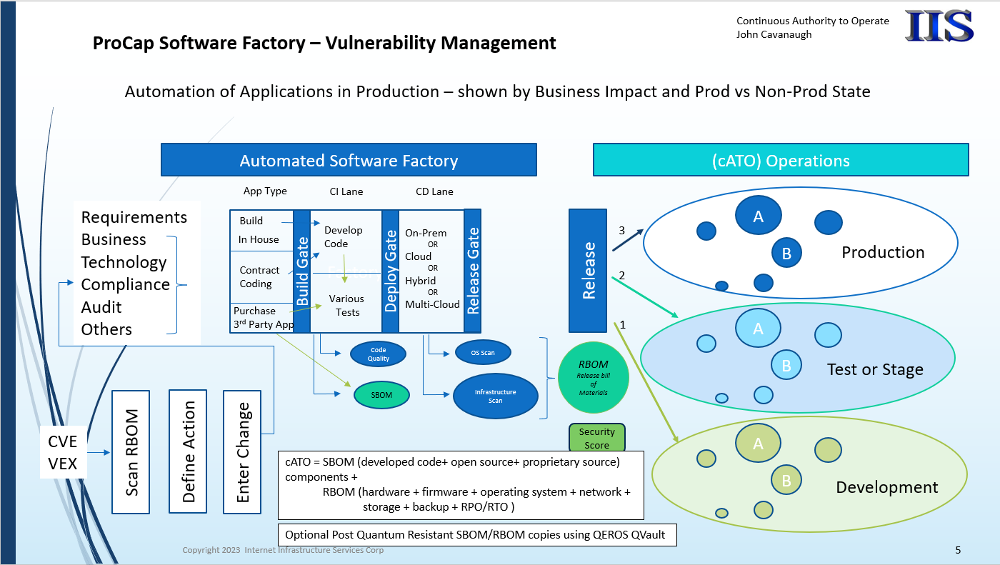
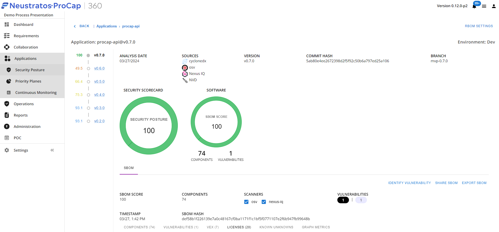
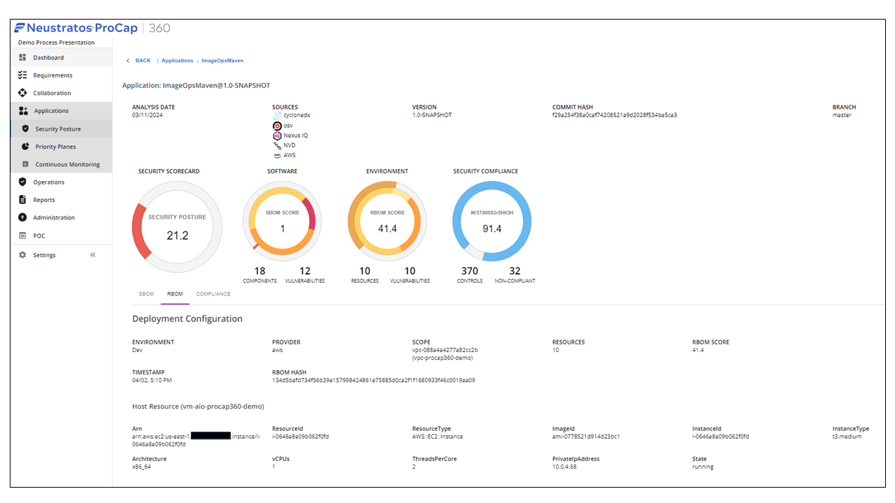
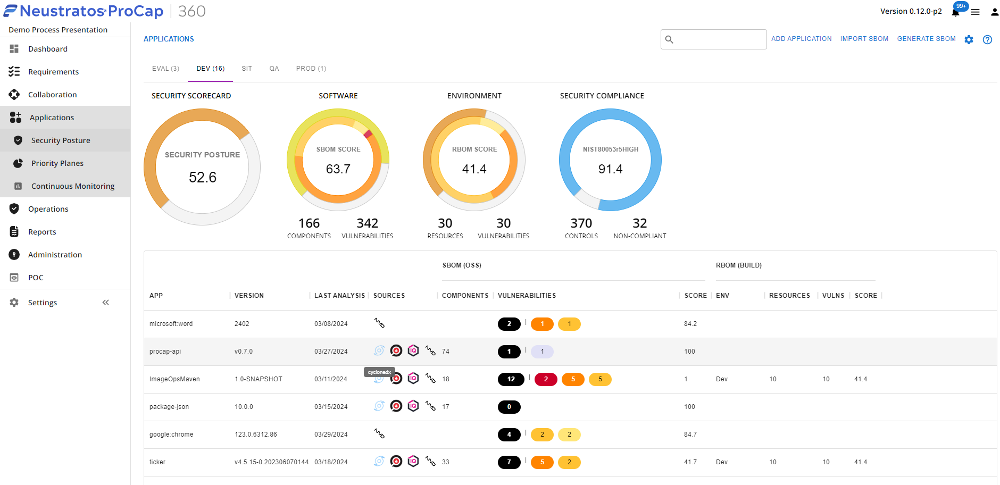
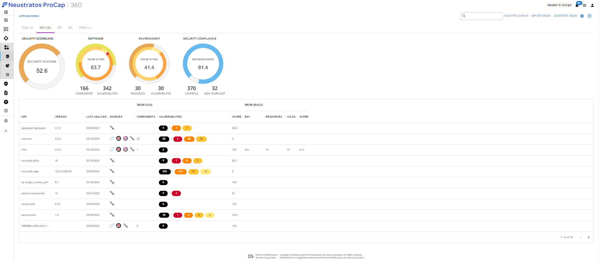
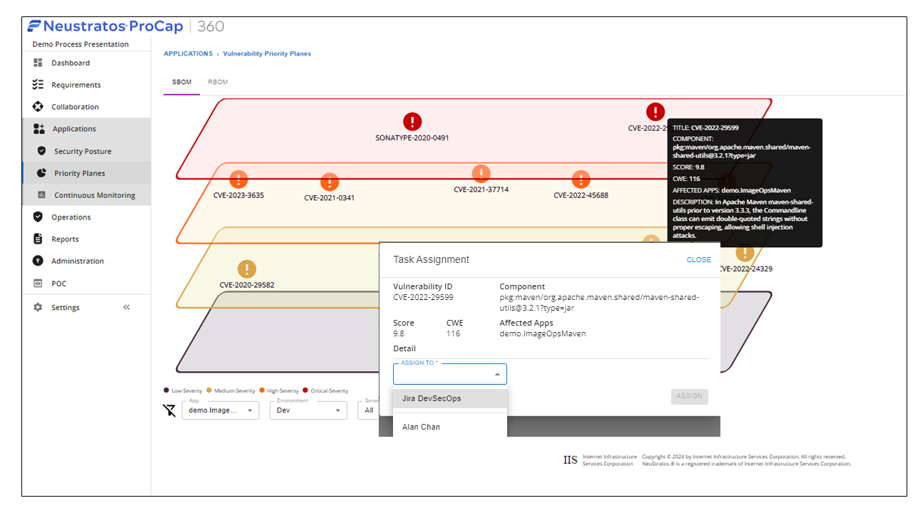

# ProCap360™ Work Plan

## 1 - Introduction to NeuStratos® ProCap360™: Enhancing Application Security and Compliance

The NeuStratos® ProCap360™ platform is a cutting-edge solution that delivers real-time security and compliance scoring for application and build components. By seamlessly integrating into your software development lifecycle (SDLC), ProCap360™ ensures that security and compliance are at the forefront of your processes.
Key Features:

Secure by Design: Our platform aligns with the DHS CISA Secure by Design concept, emphasizing proactive security measures   throughout the development lifecycle.
SBOM, RBOM, and Compliance Security Score Collaboration: ProCap360™ actively contributes to the evolving efforts of CISA, FIRST, and ATARC in the realms of Software Bill of Materials (SBOM), our patent pending Release Bill of Materials (RBOM), and Compliance Security Scores.

Validated Environments: ProCap360™ seamlessly integrates with DevSecOps SDLC environments, ensuring that both non-production and production environments undergo rigorous validation.

Continuous Monitoring and Scoring Changes: ProCap360™ provides ongoing assessment of your application components, dynamically adjusting security and compliance scores as changes occur.

Comprehensive SBOM Generation: As each application is compiled, ProCap360™ generates detailed Software Bill of Materials.  These SBOMs are either supplied by third-party tools or meticulously created within the NeuStratos® ecosystem.

By adopting NeuStratos® ProCap360™, organizations can proactively address security risks, enhance compliance, and contribute to the broader industry efforts aimed at securing software supply chains.

### 2 SBOM Description:
- The SBOM components are written on the ProCap360™ Knowledge Graph and measured against NVD Common Vulnerability Exposure (CVE) supporting the Continuous Integration (CI)pipeline. CVE CVSS scores are used in user selectable formulas to calculate the application security score.
  
- Each Application (version, date stamp, score and hash value) will be displayed. ProCap360™ is packaged with the Open Source Vulnerability (OSV) database and can optionally add other databases such as Sonatype NexusIQ for additional vulnerability enrichment.
  

 
### 3 RBOM Description:  
As each application meets or exceeds user defined vulnerability thresholds, the application release candidate (RC) will be built into the designated environment. Using Infrastructure as Code (IaC) designs the build provisioning completes and then adds the RC application code onto the build components. ProCap360™ then captures all the release components as each application is built in a Continuous Integration (CI) pipeline. ProCap360™ has a patent pending Release Bill of Materials (RBOM) that follows the OWASP format.  Terraform and Ansible Scripts, network, compute and storage components are captured in each application environment release. Cloud (AWS, Azure and Google) components resource identifiers, services, and status date stamped and hashed. On Premise components can also be captured.

### 4 Compliance Description:
Compliance Scoring (Blue Circle) is performed with user selected risk management frameworks such as:
- Cloud native (Azure Defender, AWS Security Hub) plus user selected RMF such as NIST 800-53 Rev5 low, moderate or high control levels.
  

### 5 Business Process Multiple Application SBOM and RBOM Scoring:

- Multiple Applications can be identified to support a defined business process.
  
- The Business Process multiple application portfolio will have a Security Score automatically calculated as the sum of all 16 applications.
  

### 6 Vulnerability Priority Plane View:

Displays one or all of the process application(s) vulnerabilities in a selected environment by all or selected criticality. In this example, a single application is selected and when hovering over a specific vulnerability the details are displayed.  With a second mouse click actions can be assigned to a work queue or work group or individual.

### 7 Scenarios have many dimensions:
ProCap360™-alone or ProCap360™ in collaboration with others
- component architecture
- flow (ie operational concept to be proved)
- configuration ---- JC Add graphic

#### 7.1 ProCap360™ Scenario 1 is:
- Participants (ie ProCap360™)
- Architecture (ie ProCap360™ 1 
 
- See Section   for the architectures to be used
- Flow (ie ProCap360™ 1.1 is  .See ...
- Configuration
   - ProCap360™ 1 is sunny day. Application SBOM is provided by others
      - Precheck passes 
      - SBOM has NTIA minimum fields
      - SBOM passes license checks
      - SBOM passes vulnerability checks (ie has no known vulnerabilities)
    - 1.1.n are various rainy days - precheck fails, sbom nonexistent, licensing issue, sbom vulnerabilities, exercise the different risk detection mitigations (trouble ticket, deny access, extra IDS monitoring, sandbox, initiate investigation). Main configuration change is different SBOMs.

### 8 - Existing Component Architecture
Existing investments in applications, cloud or on - premise infrastructure, asset management systems, deployment systems (network devices/firewall rules, infrastructure compute VMs, containers, and storage components) and operational monitoring tools (Capacity and Security information and event management (SIEM) and security orchestration, automation and response (SOAR), Command and control (C2), and others) can be ingested into the ProCap360™ Knowledge Graph.
Given that these existing tools and data sources were developed for specific purposes at different times, the data will be generated over different time periods and will have different dimensions.
As application workloads migrate from on-premise to cloud to hybrid on-premise with cloud or multi-cloud, aggregating these components becomes complex and costly.
CACAO (or other playbooks) can be maintained on ProCap360™ in the requirements module.  Real time viewing or editing is role based access controlled (RBAC) and auditable with current and previous versions date stamped and hashed.
ProCap360™ can grouped this data as nodes and edges in the graph database and manage disparate or sparse data on an as needed basis.

### 8.1 - ProCap360™ Architectures

The ProCap360™ cloud based architecture (collaborations shown later) exists on AWS, Azure and Google licensed for client deployments:

### 8.2 - ProCap360™ Alternate Architectures - SaaS

ProCap360™ can also be used in a software as a service module for SBOM analysis and scoring to existing and newly released CVEs, VEX or CSAF advisories.  **JC_ discuss ProCapAPI.**
#several dimensions:
#- 1.2 ProCap360™ is connecting to internal DevSecOps Pipeline and will display current application flows and  vulnerabilities via application and priority plane dashboards.
#-1.3 ProCap360™ will combine multiple applications and SBOMs that support a department business process
#1.4 ProCap360™ will combine multiple divisions of processes that support multiple sectors (finance, electric, healthcare)

### 8.3 - Flow

**JC- Add flow ideas**

### 8.4 - Configuration
ProCap360™ will combine multiple divisions of processes that support multiple sectors (finance, electric, healthcare)

ProCap360™ has Code and User Requirement/Environment/Compliance modules.  The Code Provenance module is viewed in the cyber village demonstration as outlined above.

The Requirement/Environment/Compliance modules are additional entity architects that are added into the knowledge graph to support released applications.  Here is graphic of the module pillars and their connections in ProCap360™

### 8.5 - Playbook
- CACAO playbook at **JC Add in example**
- 
## 9 - Tasks
- finalize work plan,  create demo scenarios, gather example SBOMs 
- Score SBOMs 
- Build and release apps
- Generate RBOMs
- Score RBOMs and overall Security Score
add continuous monitoring will be a key differentiator and add value to existing asset management systems.
add concept of portfolio views & sharing/communication across multiple projects and ProCap instances
**JC MORE**

### 9.1 - Status

4/1 - complete draft workplan

4/2 add workplan to Cybervillage page - gather CACAO example 

4/2 gather apps and SBOMs into a process project 

4/3 finalize complete draft workplan

4/4 add workplan to Cybervillage page - gather CACAO example 

4/4 gather apps and SBOMs into a process project 

4/4 finalize priority plane and reports

### 9.2 - Next Steps and Schedule
Attend review meeting April 5
Prep materials for 4/10 arrival and setup
Attend onsite Village 4/11 and 4/12

## 10 - Results

None yet

