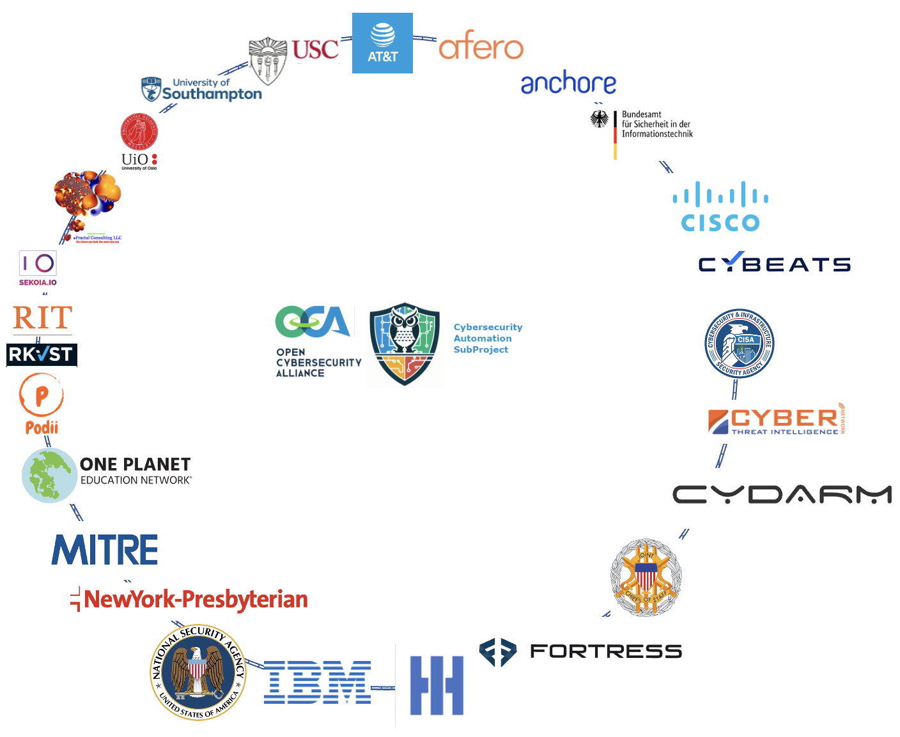
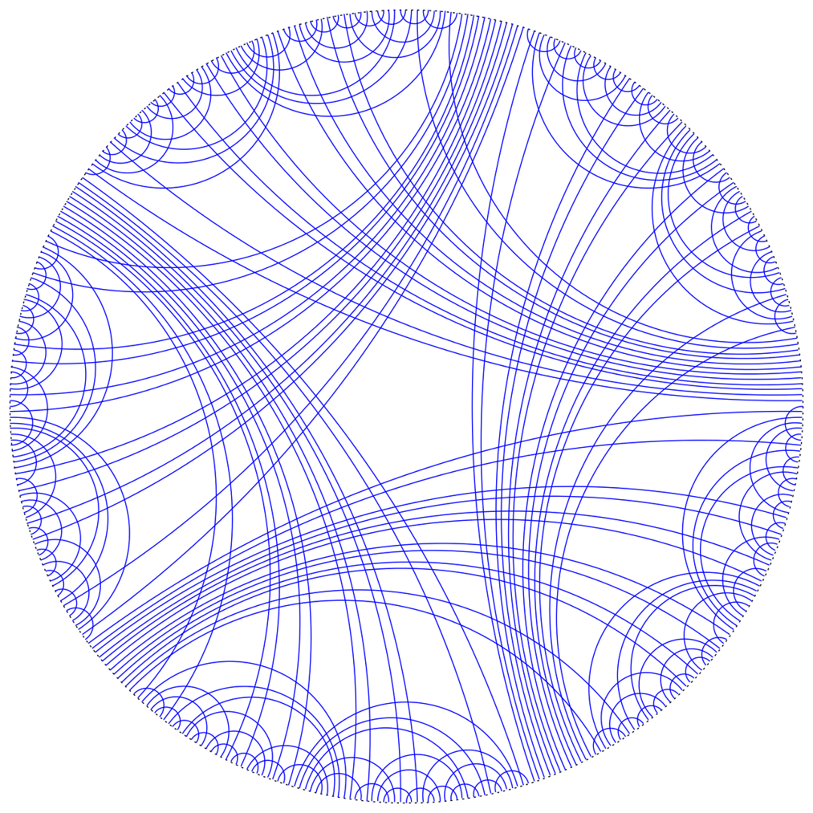

---

# Announcement

The next CASP event will be held June 13th, 2023 at USC and hybrid.

---

# Workshop / Plugfest / Hackathon

# Objective
The Open Cybersecurity Alliance (OCA) Cybersecurity Automation SubProject (CASP) is comprised of global like-minded cybersecurity vendors, end users, thought leaders and individuals who are interested in cybersecurity automation.

It is a forum where products from all vendors, researchers, and software publishers can freely exchange information, insights, and reference implementations via commonly developed code and tooling, using mutually agreed upon technologies, specifications, and procedures.

This event is for sharing information, prototyping, testing, 
and specifying interoperability among cybersecurity automation technologies.

Information on previous events can be found at
[PastPlugfests](../../PastPlugfests/).

# Technologies / Standards / Open Source Projects Involved
This is a tenative list of technologies hoped to be interworked
in CASP usecases at this plugfest:

# Organizations
This is a tenative list of organizations it is hoped will participate
with sweat equity.

It was created from participation at previous events and/or interest
expressed at CASP meetings.
This will be finalized as registration is figured out and
[sweat equity](./SweatEquity/README.md) is populated.

Each organization is encouraged to create a <3-min video about
what they will be providing. 
See [sweat equity](./SweatEquity/README.md)
for more details.
See [Video List](./SweatEquity/video_list.md) for videos created by 
participants.

# Results
After the event, the results will be found in [results](./Results/README.md).
The intent will be summarize here with a replacement for

with an acutal graph mapping interacting technologies 
and organizations involved (ie the graphs from the 2 previous sections)
as mapped by use cases demonstrated at the event.

See [graphing](./SweatEquity/graphing_results.md) for examples of how this will be done.

We'd also like to include something on participation 
like the following from the 28-Oct-2021 plugfest which had 
40 participants from 7 countries on 5 continents:

The 16-May-2022 plugfest in DC had ~70 participants (~30 in-person)
but we never made a fancy country picture like in 2021.

# To Participate
To participate,
[participate in the CASP mailing list, and attend the CASP meetings](https://lists.oasis-open-projects.org/g/oca-casp).

The event will be hybrid.
It is likely we will be space-limited 
at the physical event at USC.
USC has kindly allowed us the use of a classroom
(seats appx ??).
Should more people register
[logistics](./logistics.md)
for registration details.
than fit, we will be using 
[sweat equity](./faq.md#what-is-sweat-equity)
to determine physical attendance
(see [attendance eligibility](./faq.md#how-will-physical-attendance-be-determined)).

Note the CASP event is the day before, 
and in the same venue as, 
the CISA SBOMarama.
For more information on the CISA SBOMarama 
see {add link to Federal Register annoucement} 
and {add link to cisa.gov/sbom/whatever}.

See 
For more details, attend CASP meetings
and [participate in the CASP mailing list](https://lists.oasis-open-projects.org/g/oca-casp).

# Frequently Asked Questions (FAQ)
See the [SBOMarama CASP FAQ](faq.md) for questions 
specific to this event. 
See the [overall CASP FAQ](../../CASP-FAQ.md) for questions 
about CASP, or cybersecurity automation, overall.
