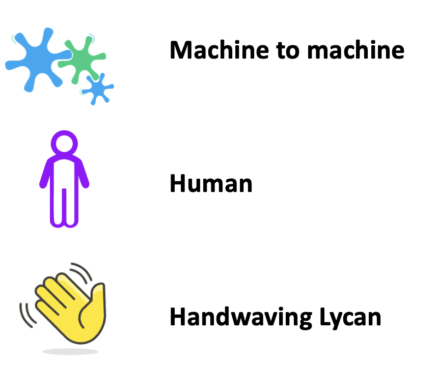

# Graphing Results

The intent is to create quick visuals representing
the interworking acheived at this plugfest.
The hope is the overall results will look something like:

The graph will be created by combining results from 
individual use cases based on 

and

with some annotations:
.

Using hypothetical (although hopefully will be actual) examples:

?? xx need to fill in here