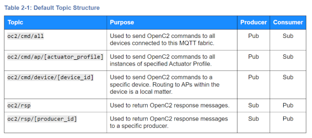

# MQTT Topics for Plugfest Participants
The OpenC2 MQTT Transfer Specification establishes the following naming guidelines
for producing and consuming devices:

## Brokers
The following message brokers are being used for testing OpenC2-based interoperability:
* [**Mosquito**](https://test.mosquitto.org/) - Eclipse foundation public test server at
`mqtt://test.mosquitto.org:xxxx` - see documentation for port options
* [**ActiveMQ**](https://activemq.apache.org/components/classic/) - MQTT v3.1 at
`mqtt+ssl://b-faad036d-e951-4aae-bf64-a171b0a16629-1.mq.us-east-1.amazonaws.com:8883`
* [**HiveMQ**](https://www.hivemq.com/) - MQTT v3.1 and v5 at
`mqtt+ssl://3271a3ddd2eb43caa7c4b195c7d6cabd.s2.eu.hivemq.cloud:8883`

The ActiveMQ and HiveMQ brokers use TLS session encryption and require basic (username/password)
authentication. Participants should request authentication info on the [CASP mail list](https://lists.oasis-open-projects.org/g/oca-casp/messages).

## Devices
Topic: `oc2/cmd/device/[device_id]`

| Participant            | device_id | Profiles                | Mosq | Apache | Hive | Notes                   |
|------------------------|-----------|-------------------------|:----:|:------:|:----:|-------------------------|
| [DKI](DKI/MQTT_Broker) | c01       | N/A                     |      |        | 8883 | Python example consumer |
| [HII](HII)             |           | blinky, sbom, pac, slpf |      |        |      |                         |
| [sFractal](sFractal)   |           | blinky, sbom, pac, slpf |      |        |      |                         |

## Producers
Topic: `oc2/rsp/[producer_id]`

| Participant            | producer_id | Profiles                | Mosq | Apache | Hive | Notes                   |
|------------------------|-------------|-------------------------|:----:|:------:|:----:|-------------------------|
| [DKI](DKI/MQTT_Broker) | p01         | N/A                     |      |        | 8883 | Python example producer |
| [DKI](DKI/MQTT_Broker) | p02         | blinky                  |      |        | 8883 | led controller          |
| [HII](HII)             |             | blinky, sbom, pac, slpf |      |        |      |                         |
| [sFractal](sFractal)   |             | blinky, sbom, pac, slpf |      |        |      |                         |

## Profiles
Schema and example messages sent between Producers and Devices for each actuator profile include:
* [blinky](https://github.com/oasis-open/openc2-jadn-software/tree/master/Test/device-blinky) -
"Hello World" example LED controller
* [sbom](https://github.com/oasis-open/openc2-jadn-software/tree/master/Test/device-blinky) -
software bill of materials retrieval operations (included in multi-profile
[blinky/twinkly](sFractal/README.md) devices)
* [pac](https://github.com/oasis-open/openc2-jadn-software/tree/master/Test/device-pac) -
security posture assessment and evaluation (PACE) operations
* [slpf](https://github.com/oasis-open/openc2-jadn-software/tree/master/Test/device-slpf) -
stateless packet filtering operations