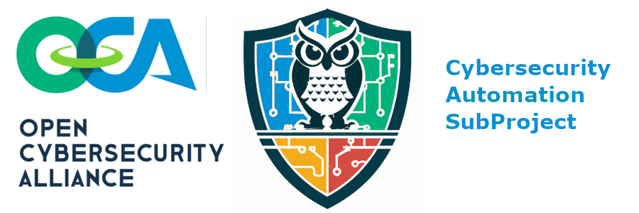

---

# Announcement

The next CASP event will be held June 13th, 2023 at USC and hybrid.

For more details, 
see the [NextPlugFest subdirectory](./Plugfests/NextPlugfest/2023-06-13-USC/README.md)
and participate in the [CASP mailing list](https://lists.oasis-open-projects.org/g/oca-casp).

Note the CASP event is the day before, and in the same venue as, 
the CISA SBOMarama.
For more information on the CISA SBOMarama see
[Federal Register annoucement](https://www.federalregister.gov/documents/2023/05/22/2023-10825/2023-cisa-sbom-a-rama)
or [CISA website](https://www.cisa.gov/sbom) (about halfway down page).

---

# OCA CASP Sub-project
The [Open Cybersecurity Alliance (OCA)](https://opencybersecurityalliance.org/) 
Cybersecurity Automation SubProject (CASP) is composed of like-minded global cybersecurity vendors, end users, thought leaders and individuals who are interested in cybersecurity automation.

It is a forum where vendors, researchers, and software publishers can freely exchange product information, insights, and reference implementations via commonly developed code and tooling, using mutually agreed upon technologies, specifications, and procedures.

OCA is an [OASIS Open Project](https://oasis-open-projects.org/). 
For more information on OCA, 
see [https://opencybersecurityalliance.org/](https://opencybersecurityalliance.org/).

For more information on CASP, see:
- CASP's OCA page at [https://opencybersecurityalliance.org/CASP](https://opencybersecurityalliance.org/CASP),
- CASP's [Cybersecurity Automation Village](https://www.cybersecurityautomationvillage.org/),
- CASP's organizational page at https://lists.oasis-open-projects.org/g/oca-casp which includes mailing list archives and how to join the mailing list.

For more information on the goals of this effort, see the [project charter](./CHARTER.md). 

General questions about OASIS Open Projects may be directed to OASIS staff at project-admin@lists.oasis-open-projects.org

# Other assets

In addition to this GitHub organization, this project also makes use of other assets. 
As a subproject of OCA, CASP operates under OCA Governance, PGB, and TSC.

# Contributing

Please read [CONTRIBUTING.md](CONTRIBUTING.md) for details how to join the project, contribute changes to our repositories and communicate with the rest of the project contributors. Please become familiar with and follow the [code of conduct](CODE-OF-CONDUCT.md).

# Governance

OCA (and therefore CASP) operates under the terms of the [Open Project Rules](https://www.oasis-open.org/policies-guidelines/open-projects-process) and the applicable license(s) specified in [LICENSE.md](LICENSE.md). Further details can be found in [GOVERNANCE.md](GOVERNANCE.md).

# CLA & Non-assert signatures required

All technical contributions must be covered by a Contributor's License Agreement. This requirement allows our work to advance through OASIS standards development stages and potentially be submitted to de jure organizations such as ISO. You will get a prompt to sign this document when you submit your first pull request to a project repository, or you can sign [here](https://www.oasis-open.org/open-projects/cla/oasis-open-projects-individual-contributor-license-agreement-i-cla/). If you are contributing on behalf of your employer, you must also sign the ECLA [here](https://www.oasis-open.org/open-projects/cla/entity-cla-20210630/).
